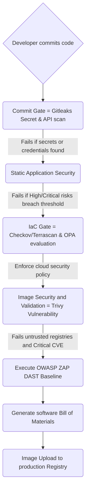

```mermaid 
flowchart TB
id1{Developer commits code} --> id2(Commit Gate = Gitleaks Secret & API scan)
id2 -->|Fails if secrets or credentials found | id3(Static Application Security)
id3 -->|Fails if High/Critical risks breach threshold| id4(IaC Gate = Checkov/Terrascan & OPA evaluation)  
id4 -->| Enforce cloud security policy | id5(Image Security and Validation = Trivy Vulnerability)
id5 -->|Fails untrusted registries and Critical CVE| id6(Execute OWASP ZAP DAST Baseline)
id6 --> id7(Generate software Bill of Materials)
id7 --> id8(Image Upload to production Registry)
```

  Check Point Rules
  > Prefer Pull requests are required.
  > Required status checks must pass.
  > Have at least one approver